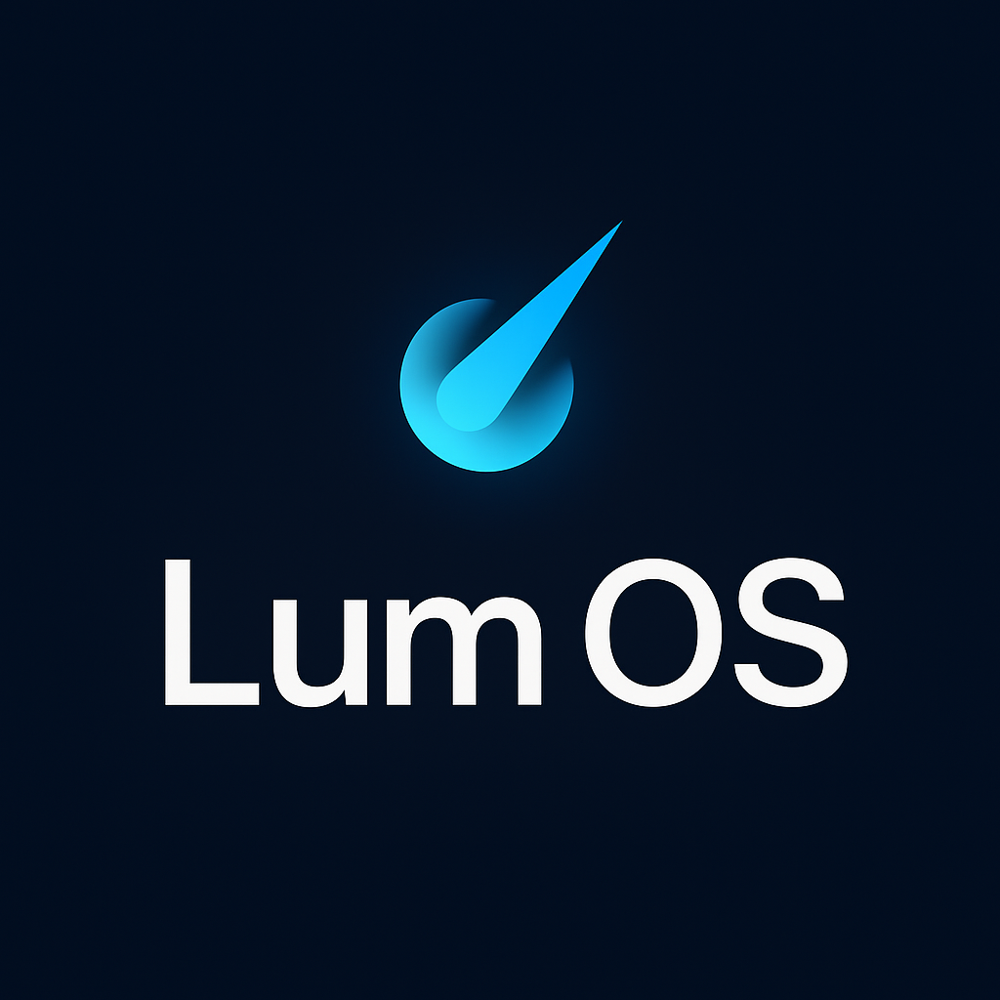

<div align="center">
  
  
  # Lum OS
  
  **A lightweight and optimized operating system for multimedia, development, and gaming on limited hardware**
  
  [](https://github.com/sowmh/Lum-OS)
  [](LICENSE)
</div>

---

## Features

- **Ultralight**: Designed for low-resource hardware  
- **Gaming**: Optimized support for games and emulators  
- **Development**: Built-in programming tools  
- **Multimedia**: Efficient audio and video playback  
- **High Performance**: Kernel optimized for maximum efficiency  
- **Customizable**: Modular and configurable interface  

---

## System Requirements

| Component      | Minimum  | Recommended |
|----------------|----------|-------------|
| RAM            | 512 MB   | 2 GB        |
| Storage        | 4 GB     | 16 GB       |
| Processor      | x86_64   | Dual-core   |

---

## Installation

### Build from Source

```bash
# Clone the repository
git clone https://github.com/sowmh/Lum-OS.git
cd Lum-OS

# Note: Build instructions will be available
# once the basic development phase is implemented
```

### From ISO

ISO images will be available in the [Releases](https://github.com/sowmh/Lum-OS/releases) section once the project reaches a later stage.

## Documentation

- [User Guide](docs/user-guide.md)
- [Developer Guide](docs/developer-guide.md)  
- [System Architecture](docs/system-architecture.md)

## Contributing

Contributions are welcome. To contribute:

1. Fork the project
2. Create a feature branch (`git checkout -b feature/new-feature`)
3. Commit your changes (`git commit -am 'Add new feature'`)
4. Push to the branch (`git push origin feature/new-feature`)
5. Open a Pull Request

## Roadmap

**Version 0.1**
- ✅Basic bootloader
- Minimal kernel
- Basic file system
- Essential drivers

**Version 0.2**
- Graphical interface
- Process management
- Networking support
- Basic multimedia

**Version 1.0**
- Full stable release
- Application suite
- Graphical installer
- Complete documentation


## License

This project is licensed under the GPL-3.0 License. See the [LICENSE](LICENSE) file for details.

## Contact

- **Issues**: [GitHub Issues](https://github.com/sowmh/Lum-OS/issues)
- **Discussions**: [GitHub Discussions](https://github.com/sowmh/Lum-OS/discussions)
- **X (Twitter)**: [@Lum_OS_Proyect](https://twitter.com/Lum_OS_Proyect)
- **Email**: [Lumos-Proyect@protonmail.com](mailto:Lumos-Proyect@protonmail.com)

---

<div align="center">
  Developed by the Lum OS community
</div>
