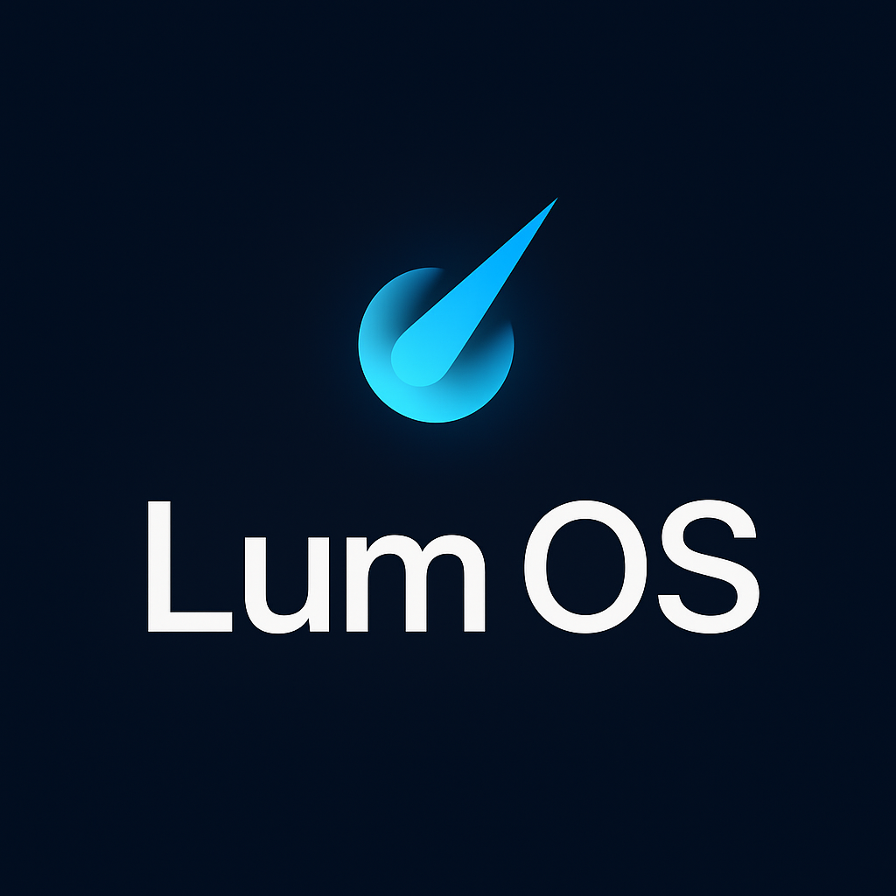

# Lum-OS

<p align="center">
  
</p>

[](LICENSE)
[]()
[]()

**Lum-OS** is a lightweight, from-scratch operating system built in C and Assembly, designed for low-resource PCs.
It includes a custom bootloader, kernel, drivers, and now has **a basic FAT file system implemented**.

## Features

### Implemented

* Custom bootloader (stage1 & stage2)
* Kernel (basic setup and booting)
* Disk I/O operations (read/write support)
* Basic FAT file system support

### In Development

* Full FAT file system (extended features)
* Tools for disk management

### Planned

* Memory management
* Preemptive multitasking
* Command-line shell
* Lightweight GUI

## Build & Run

### Prerequisites

* GCC cross-compiler toolchain
* NASM assembler
* QEMU emulator (or Bochs)
* Make

### Build

```bash
git clone https://github.com/sowmh/Lum-OS.git
cd Lum-OS
make all
```

### Run in QEMU

```bash
qemu-system-i386 -fda build/main_floppy.img -nographic
```

## Notes

* Ensure `test.txt` exists if the build Makefile includes it in the floppy image.
* Use `make clean` to remove build artifacts.

## Roadmap

* Finish FAT file system implementation
* Implement memory management
* Add multitasking and shell
* Develop basic GUI

## License

This project is licensed under the MIT License.

